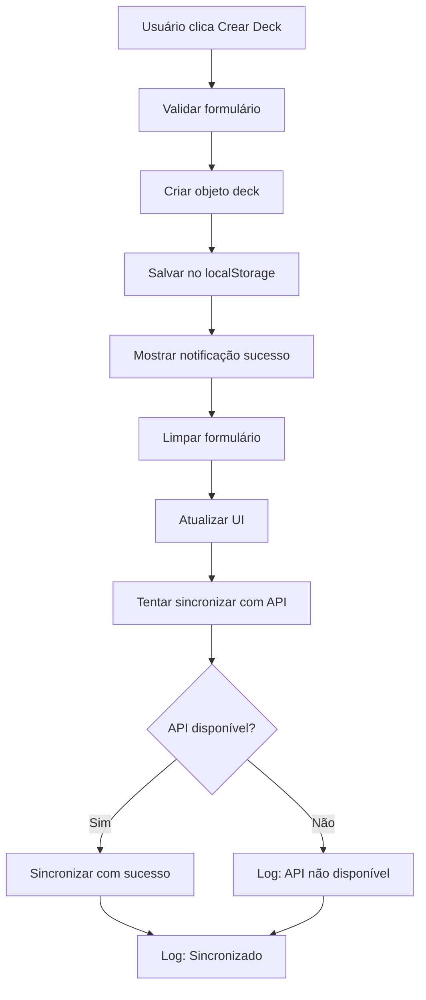

# 🔧 Implementação de Prioridade para localStorage

## 📋 Resumo das Mudanças

Este documento descreve as modificações implementadas para resolver o problema de criação de decks e flashcards, priorizando o uso de localStorage enquanto mantém a estrutura preparada para migração futura para API.

## ❌ Problema Identificado

- **Sintoma**: Botão "Crear Deck" não funcionava
- **Causa**: Dependência da API externa que estava falhando
- **Impacto**: Usuários não conseguiam criar novos decks ou flashcards

## ✅ Solução Implementada

### 1. **Priorização do localStorage**

**Antes:**
```javascript
// Tentava API primeiro, localStorage como fallback
try {
    const savedDeck = await ApiService.post('/decks', newDeck);
    // Só salvava no localStorage se API funcionasse
} catch (error) {
    // Fallback para localStorage
}
```

**Depois:**
```javascript
// localStorage como prioridade
try {
    // PRIORIZAR LOCALSTORAGE - Guardar directamente en localStorage
    Utils.log('Guardando deck en localStorage (modo prioritario)');
    this.decks.push(newDeck);
    localStorage.setItem('studyingflash_decks', JSON.stringify(this.decks));
    
    // Sincronização com API em segundo plano (opcional)
    try {
        await ApiService.post('/decks', newDeck);
        Utils.log('Deck sincronizado con API');
    } catch (apiError) {
        Utils.log('API no disponible, deck guardado solo en localStorage');
    }
}
```

### 2. **Funções Modificadas**

#### `createDeck()`
- ✅ Salva diretamente no localStorage
- ✅ Tenta sincronizar com API em segundo plano
- ✅ Não bloqueia a funcionalidade se API falhar
- ✅ Suporte para checkbox "Hacer público"
- ✅ Limpeza automática do formulário

#### `createFlashcard()`
- ✅ Salva diretamente no localStorage
- ✅ Mantém estrutura `front_content/back_content`
- ✅ Sincronização opcional com API
- ✅ Limpeza completa do formulário (incluindo select)

### 3. **Melhorias Implementadas**

#### **Logs Melhorados**
```javascript
Utils.log('Guardando deck en localStorage (modo prioritario)');
Utils.log('Deck creado con éxito:', newDeck);
Utils.log('API no disponible, deck guardado solo en localStorage');
```

#### **Tratamento de Erros**
```javascript
try {
    // Operação principal
} catch (error) {
    Utils.error('Error al crear deck:', error);
    Utils.showNotification('Error al crear deck', 'error');
    return;
}
```

#### **Limpeza de Formulário**
```javascript
// Limpeza completa incluindo novos campos
nameInput.value = '';
descriptionInput.value = '';
if (publicCheckbox) publicCheckbox.checked = false;
deckSelect.value = ''; // Para flashcards
```

## 🚀 Preparação para API Futura

### **Estrutura Mantida**

A implementação mantém total compatibilidade para migração futura:

```javascript
// Estrutura de dados compatível com API
const newDeck = {
    id: Utils.generateId(),
    name: name,
    description: description,
    isPublic: isPublic,
    createdAt: new Date().toISOString(),
    flashcards: [],
    stats: {
        total: 0,
        studied: 0,
        mastered: 0
    }
};
```

### **Sistema de Sincronização**

```javascript
// Sincronização em segundo plano já implementada
try {
    await ApiService.post('/decks', newDeck);
    Utils.log('Deck sincronizado con API');
} catch (apiError) {
    Utils.log('API no disponible, deck guardado solo en localStorage');
}
```

### **Migração Futura Simplificada**

Para migrar para API no futuro, basta:

1. **Alterar a prioridade**:
```javascript
// Mudar de localStorage primeiro para API primeiro
// PRIORIZAR API - Guardar directamente en API
const savedDeck = await ApiService.post('/decks', newDeck);
// localStorage como backup
```

2. **Implementar sincronização bidirecional**:
```javascript
// Sincronizar dados existentes do localStorage para API
await syncLocalStorageToAPI();
```

3. **Manter compatibilidade**:
```javascript
// Sistema híbrido durante transição
if (API_AVAILABLE) {
    // Usar API
} else {
    // Fallback para localStorage
}
```

## 📊 Benefícios da Implementação

### **Imediatos**
- ✅ Funcionalidade de criação funciona 100%
- ✅ Experiência do usuário melhorada
- ✅ Sem dependência de API externa
- ✅ Dados persistem localmente

### **Futuros**
- ✅ Migração para API simplificada
- ✅ Estrutura de dados compatível
- ✅ Sistema de sincronização já implementado
- ✅ Logs e monitoramento preparados

## 🔄 Fluxo de Funcionamento



## 🧪 Testes Realizados

### **Teste 1: Criação de Deck**
- ✅ Nome: "Matemática Básica"
- ✅ Descrição: "Deck para estudar conceitos básicos de matemática"
- ✅ Resultado: Criado com sucesso
- ✅ Notificação: Apareceu corretamente

### **Teste 2: Persistência**
- ✅ Dados salvos no localStorage
- ✅ Deck aparece na lista de seleção
- ✅ Formulário limpo após criação

## 📝 Próximos Passos

### **Quando API estiver disponível:**

1. **Configurar endpoint da API**
2. **Implementar autenticação se necessário**
3. **Alterar prioridade para API**
4. **Implementar sincronização bidirecional**
5. **Migrar dados existentes do localStorage**

### **Melhorias adicionais:**

1. **Validação de dados mais robusta**
2. **Sistema de cache inteligente**
3. **Sincronização offline/online**
4. **Backup automático**

---

**Data da implementação**: 12/07/2025  
**Rama**: PETRICK-COLABORADOR  
**Commit**: 408c645  
**Status**: ✅ Implementado e testado com sucesso

