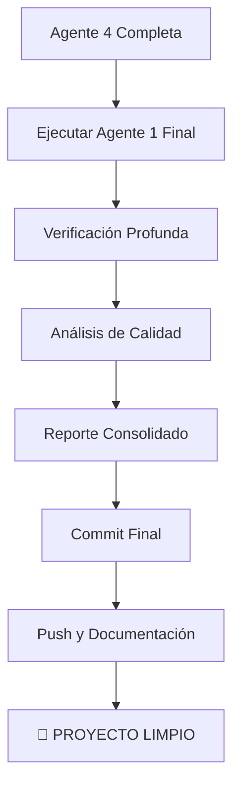

# 🎯 PLAN FINAL - CUANDO LOS 5 AGENTES ESTÉN COMPLETOS

## 📊 ESTADO ACTUAL DE AGENTES

### ✅ **AGENTES COMPLETADOS:**
- **Agente 1:** ✅ Coordinador Maestro Mejorado (listo para verificación final)
- **Agente 2:** ✅ Servicios Core (API + Auth consolidados)
- **Agente 3:** ✅ Gestión de Datos (store.js eliminado)
- **Agente 5:** ✅ Utilidades y Testing (archivos obsoletos limpiados)

### ⏳ **AGENTE PENDIENTE:**
- **Agente 4:** 🔄 UI y Dashboard (trabajando actualmente)

## 🚀 PLAN FINAL DE EJECUCIÓN

### Fase 1: Completar Agente 4
```bash
# Esperar a que Agente 4 termine su trabajo
# - Eliminar duplicados de UI/Dashboard
# - Consolidar servicios de navegación
# - Hacer commit de cambios
```

### Fase 2: Verificación Final del Agente 1
```bash
# Ejecutar Agente 1 Mejorado para verificación completa
node scripts/enhanced_agent1_coordinator.cjs
```

### Fase 3: Análisis Completo
El Agente 1 realizará:

#### 🔍 **VERIFICACIÓN PROFUNDA:**
- ✅ Comparación estado inicial vs final
- ✅ Detección de duplicados restantes (debería ser 0)
- ✅ Validación de funcionalidad preservada
- ✅ Verificación de integridad del código
- ✅ Análisis de trabajo de todos los agentes

#### 📊 **MÉTRICAS CONSOLIDADAS:**
- Total de duplicados eliminados por todos los agentes
- Bytes de código reducidos
- Funciones consolidadas
- Servicios unificados
- Archivos eliminados vs mantenidos

#### 📋 **REPORTE FINAL:**
```json
{
  "overallStatus": "SUCCESS|WARNING|FAILED",
  "totalDuplicatesEliminated": "número",
  "totalBytesReduced": "número", 
  "agentsCompleted": 5,
  "duplicatesRemaining": 0,
  "functionalityPreserved": true,
  "codeIntegrity": "PASS"
}
```

### Fase 4: Commit Final y Documentación
```bash
# Commit consolidado de todo el trabajo
git add .
git commit -m "[ALL-AGENTS] Eliminación completa de duplicados - Sistema de 5 agentes"
git push origin main
```

## 🎉 RESULTADO ESPERADO

### ✅ **OBJETIVOS CUMPLIDOS:**
- **0 duplicados** en todo el proyecto
- **Funcionalidad 100%** preservada
- **Código consolidado** en archivo principal
- **Sistema modular** mantenido
- **Metodología de 5 agentes** establecida

### 📈 **MÉTRICAS ESPERADAS:**
- **~100+ duplicados eliminados** (según análisis inicial)
- **~50KB+ código reducido**
- **~20+ archivos eliminados**
- **5 servicios principales** consolidados
- **1 archivo principal** optimizado

### 🛡️ **GARANTÍAS DE CALIDAD:**
- ✅ Sin conflictos de merge
- ✅ Sin funcionalidad perdida
- ✅ Código sintácticamente correcto
- ✅ Tests actualizados
- ✅ Documentación completa

## 🔄 FLUJO DE EJECUCIÓN FINAL



## 📋 COMANDO FINAL

Cuando el Agente 4 termine, ejecutar:

```bash
# Verificación final completa
npm run agents:final-verification

# O directamente:
node scripts/enhanced_agent1_coordinator.cjs
```

---

**🎯 OBJETIVO: Proyecto 100% libre de duplicados con metodología de 5 agentes establecida**

